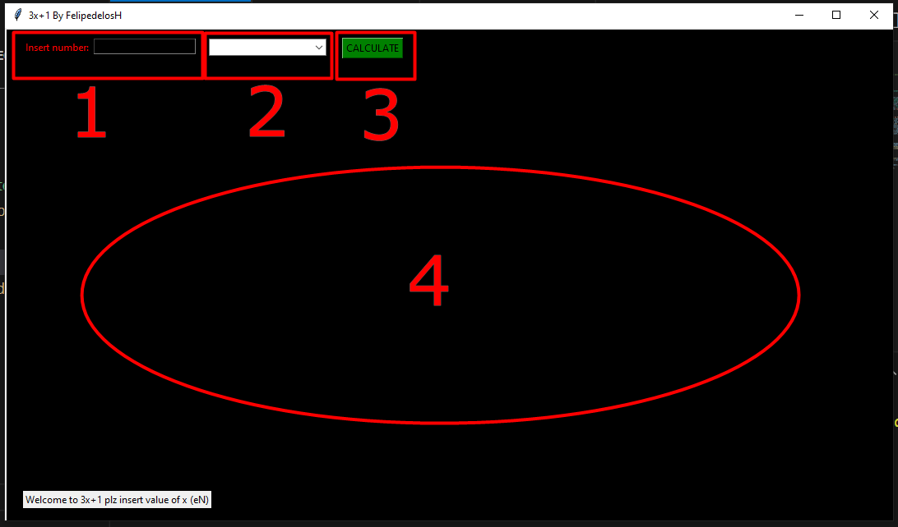
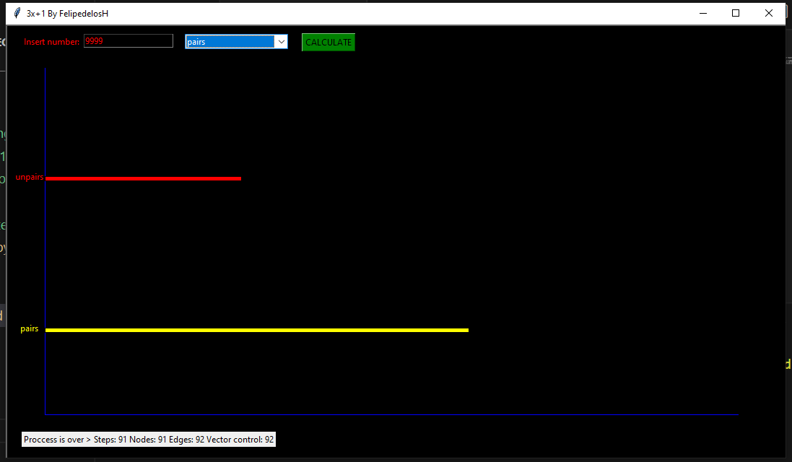

# FelipedelosH

In this time i see with my eyes what happend with (3x+1).
The logic is simple:
getme a integer number, the number is bigger than 0.
and hav 2 rules if the number is pair you divide for 2 and the number is unpair multiply for 3 and plus 1. Iterate and always end in 4>2>1.

## Interface Function

1 -> Enter the number to examinate.
2 -> Select a Graphic type
3 -> Show the graphic
4 -> Area to show the graphic

## Distribution of Pair and Unpair

The trick is: "The most part of numbers forces to be pair"
and divide reduces a number so many times than grow multiply 3.
The algorithm forces a number to fall in 4>2>1
